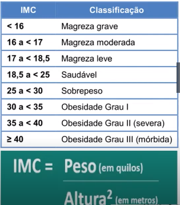

Bootcamp Santander Dio - Desafio Calculadora de IMC

Objetivo: Criar uma calculadora de IMC, o programa se dará por meio de dados que serão lidos no terminal, dados estes que serão: Nome, Peso e Altura.

Programa citado acima deverá seguir descrições abaixo:

- Criar classe Pessoa com os seguintes atributos
  - String Nome
  - Double Peso
  - Double Altura

- Função: 
  - Calcular IMC

- Aplicar Tratamento de exceções
  - Tratar valores inválidos
- Testes de unidade

- Conforme tabela abaixo realizar o cálculo e mostrar no terminal a informação sobre o IMC do usuário.
- 